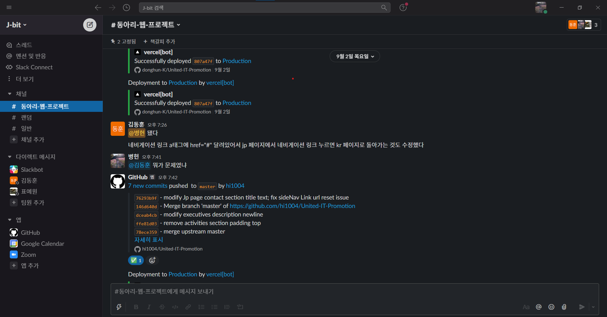
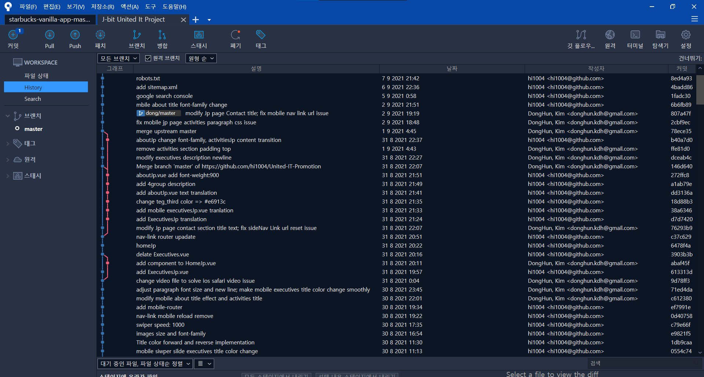

# :pushpin: J-bit United IT

> 2021 年、大学 IT サークルの広報サイト
> <a href="https://bit.ly/3yNto4e" target="_blank" style="fontSize:50px">DEMO</a>

 

## 1. 製作期間 ＆ 参加人数

- 2021 年 10 月 ~ 11 月（一ヶ月）

| 名前                                                      |                      役割                       |                              サークル職位 |
| --------------------------------------------------------- | :---------------------------------------------: | ----------------------------------------: |
| 오병헌(オ・ビョンホン) | 総括・責任者</sapn> | 副会長 |
| 김동훈(キム・ドンフン)                                    |              責任者と全般的な総括               |                                6 組リーダ |
| 표예원(ピョ・イェウォン)                                  |                 デザイン・映像                  |                                  広報部長 |

 

## 2. 使った技術

背景デザインは Canvas で描いたものであり、YouTube を参考にして作りました。

#### `Front-end`

- HTML5
- Scss
- vue.js 3.0
- node.js
- swiper.js
- lodash.js
- kakao.js
- gsap.js
- scrollMagic.js
- webpack

	
<b>協業ツール</b>

コミュニケーションツールは`Slack`や`kakaoTalk`を使い、効率的に働く環境でプロジェクトをすんなりと進めることができました。

`git`を活用し、協業することでお互いにコミュニケーションの重要性を気づきました。

 

## 3. 開発した理由

- IT サークルなのに、これといった WEB サイトがなかったから。
- 効率的に新入部員を募集するため。
- チームプロジェクトがしてみたかったから。
- 技術力向上のため。

	
<b>開発した理由の詳細説明</b>

	

	
IT サークルの部員募集を効率的にするため、３人で作った初チームプロジェクトです。2020 年コロナ禍のせいで、サークル活動をする部員が少なくなっていました。

このままだと当時、副会長だった私は人の不足でサークル運営に支障が出る危機感を感じ、現実的に状況を把握し、役員会議を開き、積極的に現問題について語り合いました。

その結果、チームプロジェクトの経験がなかった私は、サークル専用のサイトを作り、広報することを提案し、3 人でこのプロジェクトをチャレンジすることになりました。

 

## 4. コア機能

- このサービスのポイントは広報効果を極大化するためにユーザー中心に作りました。
- JavaScript の Canvas で UX/UI に力を入れ、動的に動くデザインで募集に興味を持たせることができます。
- IT サークルのカカオトークチャンネルから受付、申し込めるように連携しました。
- 日本人募集のため、言語設定可能にしました。（日韓交流するタンデムがあるため、日本人募集）

	
<b>コア機能の詳細説明</b>

### 4.1. Canvas

- **Background Canvas** :pushpin: [コード確認](https://github.com/hi1004/United-IT-Promotion/tree/master/src/config/background)

### 4.2. Kakao.js

- **SDK を初期化** :pushpin: [コード確認](https://github.com/hi1004/United-IT-Promotion/blob/master/index.html#L125-L133)
- 受付の効率を上げることができました。
- <a href="https://developers.kakao.com/docs/latest/ko/getting-started/sdk-js" target="_blank">参考サイト</a>

### 4.3. 言語設定機能

- **RouterLink** :pushpin: [コード確認](https://github.com/hi1004/United-IT-Promotion/blob/master/src/components/etc/SidebarMenu.vue#L87-L108)

- [参考サイト](https://router.vuejs.org/api/)

### 4.4 SideNavbar ScrollTrigger

- **Link Click & Scroll Event** :pushpin: [コード確認](https://github.com/hi1004/United-IT-Promotion/blob/master/src/config/etc/sidebarMenu.js#L81-L249)
- gsap の ScrollTrigger を活用しました。
- [参考サイト](https://greensock.com/docs/v3/Plugins/ScrollTrigger)

 

## 成果 & 感じたこと

- 10 人の新入部員の募集に成功しました。
- 目標を達成し、私を含めてチーム全体が成長しました。
- 一人で作るより皆と作る方が楽しかったです。
- 作り上げたサイトを実際に運営し、サービスを提供した成功経験が自分の成長に繋がることに気づきました。
